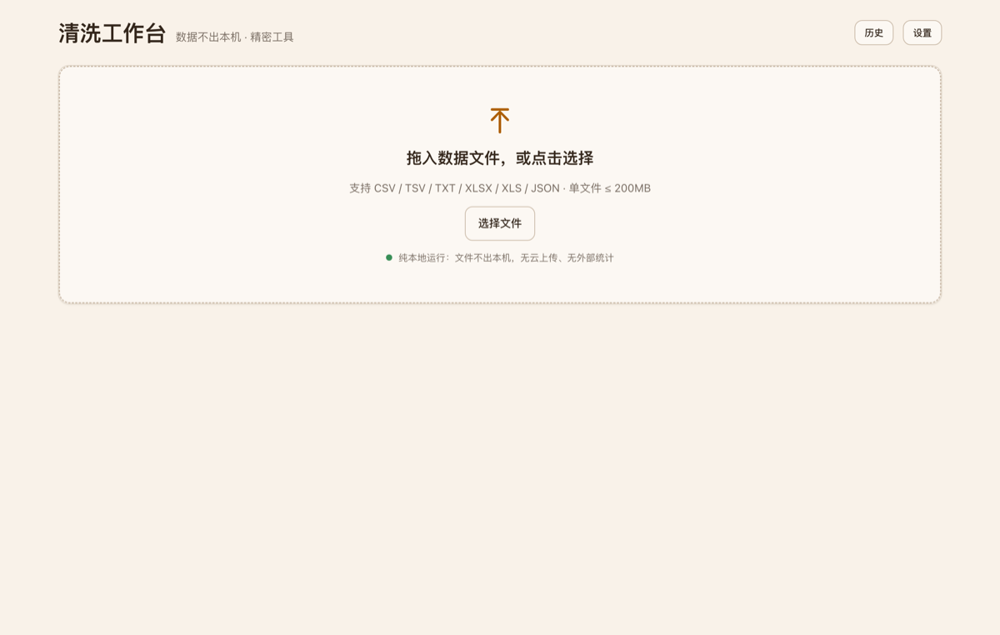
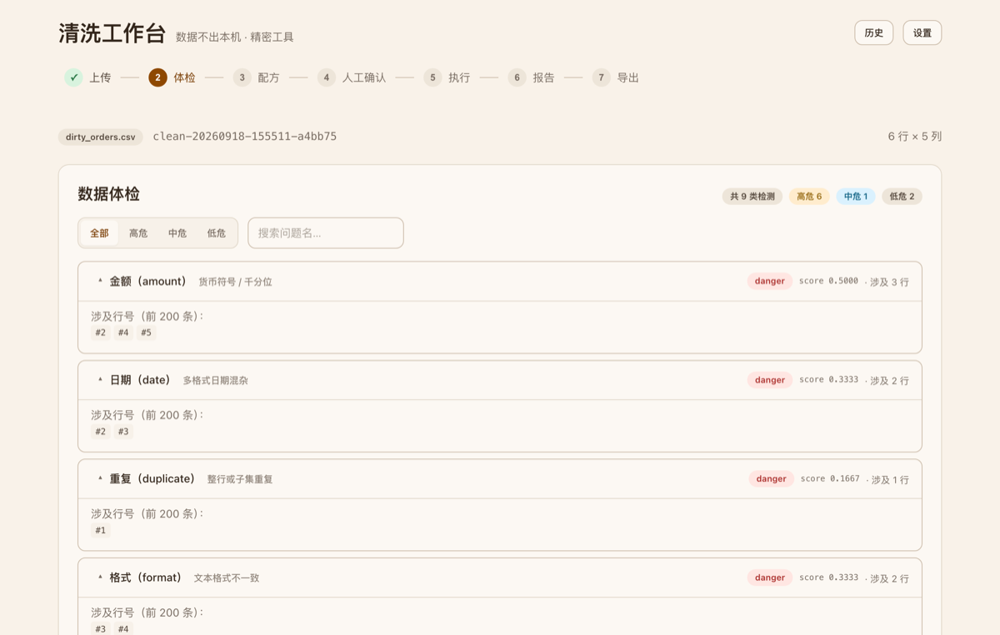
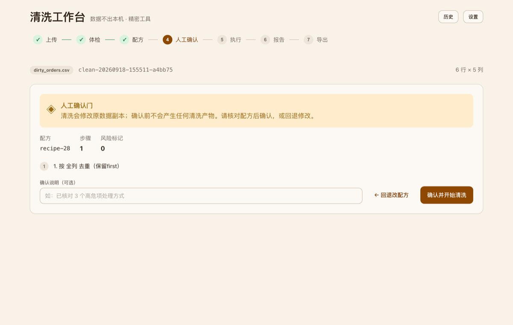
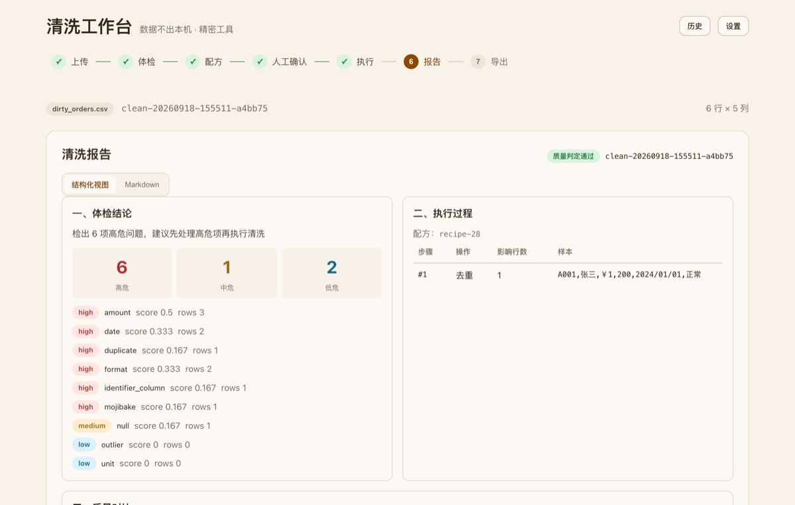

# CleanWorkbench · 本地数据清洗台

[](LICENSE)
[](backend/requirements.txt)
[](frontend/package.json)

> **本地运行，数据不出本机。** 零上传——全部清洗逻辑在浏览器与本地引擎间通过环回完成；AI 辅助（列语义建议 / 报告人话版）**默认关闭**，由你决定是否开启，开启后仅发送列的形态（列名 + 列级统计），**不发送任何数据值**。


以下是**真实运行截图**（2026-09-18 采集，macOS + Chrome，由脚本驱动真实界面完成「上传 → 体检 → 人工确认 → 报告」全流程后截取，非手绘示意图）：

| 上传 | 数据体检（9 类检测器） |
|---|---|
|  |  |
| **人工确认门（不确认即无产物）** | **清洗报告（三段式 + 未处理项清单）** |
|  |  |

拖入 CSV / Excel / PDF → 一键体检（9 类检测器）→ 勾选处理方式生成配方 → 人工确认 → 执行清洗 → 前后校验 → 报告 → 导出四件套。

## 价值主张

- **本地零上传**：前端本地读取文件、以数据流提交解析；后端不接收、不保存原始文件。全流程仅绑定 `127.0.0.1`，无任何外网出站请求。
- **确定性清洗、零编造**：全部检测器与清洗操作均为确定性纯函数，**AI 不参与数据值改写**（AI 建议只落成标准配方步骤、可重放，值仍由既有算子决定）；报告如实列出"未处理 / 未识别"项，绝不把没做的写成已做。
- **人工门硬拦截**：不点确认，不产生任何清洗产物。
- **原件只读**：原文件永不覆盖，清洗产物 = 清洗副本 + 完整转换日志。
- **配方可导出、可重放**：`recipe.json` 一次导出，跨会话一键重放，结果逐字节一致。
- **全格式导出**：干净数据（CSV / Excel / JSON / ODS / PDF / SQL / 自定义模板）+ 报告（MD / PDF）+ 问题明细与汇总 CSV + 配方 JSON。

## 洗前 / 洗后（真实运行示例）

下表是**仓库自带合成样例**（`samples/dirty_orders.csv`，6 行 × 5 列）配 `samples/recipe_orders_demo.json` 配方的**实际执行结果**——不是手绘示意图，可由 `python scripts/demo_before_after.py` 原样复跑复现（下同）。

洗前：

| id | 名称 | 金额 | 日期 | 备注 |
|---|---|---|---|---|
| A001 | 张三 | ￥1,200 | 2024/01/01 | 正常 |
| A001 | 张三 | ￥1,200 | 2024/01/01 | 正常 |
| A002 | 李四 | *(空)* | 2024-13-99 | 乱码� |
| A003 | 王五 | 3000元 | 2024.02.30 | ␣前后空格␣ |
| A004 | Ｔｅｓｔ | ５０ | 2024-03-15 | 全角数字 |
| A005 | 赵六 | -1200 | 2023-12-31 | 负数金额 |

洗后（同一份配方的执行结果，5 行 × 5 列）：

| id | 名称 | 金额 | 日期 | 备注 |
|---|---|---|---|---|
| A001 | 张三 | 1200.00 | 2024-01-01 | 正常 |
| A002 | 李四 | *(空)* | 2024-13-99 | 乱码� |
| A003 | 王五 | 3000元 | 2024.02.30 | 前后空格 |
| A004 | Test | 50.00 | 2024-03-15 | 全角数字 |
| A005 | 赵六 | -1200.00 | 2023-12-31 | 负数金额 |

（`␣` = 首尾空格，便于看清被删掉的是哪两个字符。）

读法：

- **改了什么**：重复行 6 → 5（`row_dedupe`）；货币千分位 ￥1,200 → 1200.00（`cell_amount_clean`）；全角 ５０ → 50.00、Ｔｅｓｔ → Test（`cell_fullwidth`）；首尾空格去除（`cell_trim`）；2024/01/01 → 2024-01-01（`cell_date_normalize`）。
- **故意没改（判定不了就不猜）**：空金额、`2024-13-99`、`2024.02.30`、乱码 `乱码�` 原样保留，并进报告的「未处理项」清单——清洗不是把字段填满，而是**把能确定的做掉、把不能确定的标出来**。
- **前后校验由引擎自动比对**（非人工填报）：`rows` 6 → 5、`columns` 5 → 5、`dup_ratio` 0.1667 → 0.0、`empty_ratio` 0.0333 → 0.04（去重后分母变小，空单元格数不变）、`passed: true`。

报告实样（引擎输出，节选）：

```markdown
## 一、体检结论

结论：检出 6 项高危问题，建议先处理高危项再执行清洗

| 严重度 | 数量 |
|---|---|
| 高 | 6 |
| 中 | 1 |
| 低 | 2 |

- **amount**（high，score=0.5）：[2, 4, 5]
- **date**（high，score=0.3333）：[2, 3]
- **duplicate**（high，score=0.1667）：[1]
- **format**（high，score=0.3333）：[3, 4]
- **identifier_column**（high，score=0.1667）：[1]
- **mojibake**（high，score=0.1667）：[2]
- **null**（medium，score=0.1667）：[2]

## 二、执行过程

配方：orders-demo

- 步骤1 row_dedupe: {'step': 1, 'op': 'row_dedupe', 'rows_affected': 1, 'sample_before': ['A001', '张三', '￥1,200', '2024/01/01', '正常']}
- 步骤2 cell_trim: {'step': 2, 'op': 'cell_trim', 'rows_affected': 1}
- 步骤3 cell_amount_clean: {'step': 3, 'op': 'cell_amount_clean', 'rows_affected': 3}
- 步骤4 cell_date_normalize: {'step': 4, 'op': 'cell_date_normalize', 'rows_affected': 1, 'sample_before': '2024/01/01'}
- 步骤5 cell_fullwidth: {'step': 5, 'op': 'cell_fullwidth', 'rows_affected': 1}

## 三、质量对比

| 指标 | 清洗前 | 清洗后 |
|---|---|---|
| rows | 6 | 5 |
| columns | 5 | 5 |
```

复跑：`bash scripts/start.sh`（或见「快速上手」）→ 后端 `python scripts/demo_before_after.py`，环境实测 Python 3.11.9 / macOS 26.6.2。

## 技术栈

| 层 | 技术 | 说明 |
|---|---|---|
| 流程编排 | LangGraph | 8 节点清洗线 + 人工中断（HITL）+ 校验回退（≤2 次） |
| 本地服务 | Python | 仅绑 `127.0.0.1` 的本地 HTTP 服务 |
| 前端 | React | 拖入区 / 体检视图 / 配方面板 / 确认门 / 进度 / 报告 / 导出 |
| 本地存储 | SQLite | 运行状态 / 节点执行表 / 配方（与检查点同库） |

## 快速上手

### 一键启动（推荐）

```bash
./scripts/start.sh
```

该脚本会自动建虚拟环境、装依赖、拉起后端（`127.0.0.1:8321`）与前端（`http://127.0.0.1:5173`），并轮询后端健康检查；`Ctrl+C` 一键停止。脚本已置可执行位（`chmod +x scripts/start.sh`，仓库内已提交为 `100755`）。
若需先手动确认环境（Node / Python 路径），或想看逐屏操作说明，见 [`docs/使用说明.md`](docs/使用说明.md)。

> `scripts/start.sh` 默认使用 nvm 下的 Node 路径；如本机 Node 不在该路径，请先行导出 `PATH` 或改用下方「前端」手动步骤。

### 后端（Python ≥ 3.10，实测 CPython 3.11.9 / 3.12.14 通过）

```bash
cd backend
python -m venv .venv && source .venv/bin/activate   # macOS / Linux
pip install -r requirements.txt
python -m app.server   # 启动本地服务，监听 127.0.0.1:8321
```

### 前端（Node 18+）

```bash
cd frontend
npm install
npm run dev   # 打开 http://127.0.0.1:5173
```

### 合成示例数据

```bash
python scripts/generate_samples.py   # 生成 samples/ 下示例 CSV（纯合成，非真实数据派生）
```

## 边界声明

- **数据不出本机**：本项目不接入任何云端服务、不调用外部 API、不进行遥测统计。所有流量均为浏览器到本地引擎的环回调用。
- **客户真实数据绝不入仓**：仓库内仅含脚本生成的合成示例数据。
- **扫描版 PDF 不支持**：如实提示，不假解析。
- **不自动修复歧义值**：无法确定的内容一律标记并询问用户，不猜测。

## 目录结构

```
.github/           CI 工作流（后端测试 + lint、前端构建）与 issue 模板
backend/           引擎代码（解析 / 检测器 / 操作 / 配方 / 状态机 / 校验 / 报告 / 导出 / 持久化 / 服务层）
backend/tests/     L1~L5 分层测试（单元 / 集成 / 系统 / 回归 / 验收）
frontend/          React 前端（Vite + TypeScript）
samples/           合成示例数据（脚本生成）
screenshots/       真实运行截图（README 引用）
scripts/           辅助脚本（示例数据生成 / 洗前洗后对比示例 / 一键启动 / 全链路冒烟 / 洗后对账）
docs/              用户说明、依赖许可清单、检测器—操作契约
```

## AI 辅助（可选 · 默认关闭）

清洗主链路（解析 → 体检 → 规划 → 确认 → 执行 → 导出 → 报告）**不调用任何模型**，出站请求 0 次；以下 AI 能力**默认关闭**，由你决定是否开启：

| 能力 | 你需要知道的口径 |
|---|---|
| 列语义建议 | 体检屏每列的「AI 建议」区**默认折叠，点开才请求**；返回受控语义类型 + 一句依据 + 建议算子与参数 |
| 报告人话版 | 报告屏顶部「人话摘要」区**默认折叠，点开才请求**；**只读**展示，不回写结果字段，导出与报告默认不含该文本 |
| 加入配方 | 只**追加配方步骤**（与既有算子契约同构、可重放），**不写任何数据值、不触发执行** |

- **数据不出本地**：默认只发送**列的形态**（列名 + 列级统计），**不发送任何原始数据值**；列名命中敏感词表时替换为「列#n」。
- **密钥只从环境变量 / 仓库根 `.env` 读**（键名见 [.env.example](.env.example)），不落日志、不落台账、不回显；请求体一旦携带密钥字段直接 `400`。
- **出厂默认全关**：不配置 `CLEAN_AI_*` 时与既有功能完全一致（既有 13 个端点与界面零变化）。
- **失败不阻塞**：模型 / 端点不可用时一律 `200 + degraded=true + 原因`，其余功能不受影响。
- 落地细节与接口契约见 [docs/contracts/detector_operation_contract.md](docs/contracts/detector_operation_contract.md)。

## 开源与支持

| 项 | 口径 |
|---|---|
| 许可证 | [Apache-2.0](LICENSE)（全文 201 行）；依赖白名单 Apache-2.0 / MIT / BSD / ISC，禁 GPL / AGPL / SSPL，详见 [docs/dependency-license.md](docs/dependency-license.md) |
| 运行环境 | Python **≥ 3.10**（实测 CPython 3.11.9 / 3.12.14）；Node **18+**（实测 v24.18.0）；前端构建产物 css 27.19 kB / js 189.63 kB |
| 支持范围 | **macOS 已实测**（macOS 26.6.2 + Chrome，全流程实跑通过）；**Windows 未验证（未做真机实测）**；Linux 未做本地实测（CI 在 `ubuntu-latest` 上执行后端测试与前端构建） |
| CI | [`.github/workflows/ci.yml`](.github/workflows/ci.yml)：后端 `pytest`（Python 3.11 / 3.12 矩阵）+ `flake8` / `pylint` + 前端 `npm ci && npm run build`，**任一环节失败即红**（不用 `|| echo` 吞错） |
| 贡献方式 | 见 [CONTRIBUTING.md](CONTRIBUTING.md)：issue 须用合成样例复现、**禁止粘贴真实客户数据**、提交前跑全量测试；issue 模板见 [`.github/ISSUE_TEMPLATE/`](.github/ISSUE_TEMPLATE/) |
| 安全与隐私 | 数据不出本机（仅环回 `127.0.0.1`）、AI 辅助默认关闭（开启后仅发送列的形态：列名 + 列级统计，不发数据值）、原件只读 |
| 已知风险接受 | `pytest` 维持 8.3.4：`pytest-asyncio==0.25.2` 硬约束 `pytest<9`，无法升到修复版 9.0.3（pip 解析 `ResolutionImpossible`）。接受 CVE-2025-71176 / GHSA-6w46-j5rx-g56g，仅影响开发期测试工具 |

## 服务承接与联系

开源仓库之外，我们承接数据清洗的实际活儿：

| 事项 | 入口 |
|---|---|
| 用起来有问题 / 提 bug / 提需求 | 本仓库 Issues：请用**合成样例**复现，**切勿粘贴真实业务数据**（口径见 [CONTRIBUTING.md](CONTRIBUTING.md)） |
| 承接咨询（清洗外包 / 定制检测器 / 部署集成） | 本仓库 Issues，标题注明「承接咨询」 |

承接范围：

- **单数据集清洗外包**：你给脏数据（本地或脱敏样本），我们交付干净数据 + 前后对比报告 + 可重放配方；
- **定制检测器 / 清洗操作**：票据、账目、客户主数据、单据类字段等行业规则按需增补；
- **部署与集成**：本地部署、导出模板对接、批量跑批。

两条底线：

- **数据不出你的机器**：默认在你自己的机器上跑，我们只交付工具与配置；确需我方代跑时另行约定数据交接与销毁。
- **不承诺包治**：判定不了的值一律标记、不猜；报告如实列「未处理 / 未识别」项，清单随报告交付。

## 许可证

[Apache-2.0](LICENSE)
